# Análisis de sistemas de enrutamiento utilizando simulación discreta

Laboratorio 4 de la cátedra Redes y Sistemas Distribuidos 
Grupo 01
Integrantes :

-   *Bazán Tomás*
    
-   *Carabelos Milagros*
    
-   *Pereyra Carrillo Juan Cruz*

## Indice

1. [Resumen Abstracto](#Resumen-Abstracto:)

2. [Introducción](#Introducción:)

3. [Análisis de la implementación inicial](#Análisis-de-la-implementación-inicial:)

4. [Método](#Metos:)

5. [Análisis de Casos](#Parte-Mili)

6. [Resultados](#Resultados:)

7. [Discusión](#Discusión:)

8. [Bibliografía](#Bibliografía-o-Referencias)


---

## Resumen Abstracto:

Aca hay que poner dos/uno parrafitos resumiendo la totalidad del proyecto y sus resultados 
​

---

## Introducción: 

​	En este Proyecto estaremos simulando un protocolo de enrutamiento que diseñaremos, en principio, para una topología de anillo. Veamos entonces que es un protocolo de enrutamiento y que problemas trata de abordar.

​	Los protocolos de enrutamiento pertencen a la capa de red y tienen como propósito llevar paquetes de un host cualorigen a uno de destino siguiendo una ruta conveniente, veremos más adelante que este es nuestro tema central en este laboratorio. Además esta es la principal función de la capa de red, en la mayoría de redes los paquetes requieren de múltiples saltos para llegar a su destino, por eso se hacen uso de algoritmos de enrutamiento, los cuales son los encargados de decidir por cuál linea de salida deben transmitirse los paquetes que llegan a cada enrutador.

​	Como ya mencionamos, vamos a trabajar sobre un *topología de anillo*. El estudio de topologías es un tema muy amplio en las Ciencias de la Computación el cual no abordaremos en este proyecto. Dicho esto, veamos entonces de qué se trata la topología de anillo.

​	La topología de anillo consiste en una estructura donde cada dispositivo se conecta a la red en un camino circular. A su vez, cada uno  se conecta con dos dispositivos vecinos, formando la estructura de anillo. Las topologías de anillos pueden ser unidireccional o bidireccional, en nuestro caso se trata de la segunda. A esto se lo denomina topología de doble anillo (en inglés Dual Ring Topology o full-duplex). 

​	Ahora bien, ¿Qué beneficios nos da una topolgía de anillo y qué deberíamos tener en cuenta a la hora de considerarla?

​	Algunas de las ventajas de esta topología son:\

- No requiere de un nodo central o servidor que administre la conectividad entre dispositivos
- Ya que la configuración de la linea es de punto a punto con un dispositivo en cada lado. Es facil de instalar y reconfigurar, ya que para agregar o quitar dispositivos a la red solo requiere mover dos conexiones.
- Fácil identificación y aislamiento de errores.
- Costo de instalación y expansión bajo.

​	Mientras que las desventajas son:

- Una falla en uno de los dispositivos afecta a la toda la red.
- Es más lento que otras topologías (como la estrella) ya que los datos deben viajar a través de varios dispositivos de la red.
- Si es necesario instalar hardware se debe hacer en cada dispositivo, lo que lo hace más costoso.

​	Dicho esto analicemos nuestro caso de estudio y cuál será nuestro objetivo: 

​	Se nos proporciona con una red de anillo la cual consta de distintos nodos. Cada uno simula una capa de aplicación que envía o recibe el paquete, una capa de red que chequea si es el destino o no, y una capa de enlace que conecta a los dos nodos vecinos mediante dos enlaces distintos. Para enviar paquetes, lo hace en un mismo sentido siempre. Es decir que si envío a la derecha y quiero enviar un paquete a mi primer vecino a la izquierda, el paquete va a recorrer toda la red hasta llegar a su destino.

​	Tenemos que diseñar un algoritmo que mejore de alguna manera este comportamiento y analizar el rendimiento de la red antes y después de las mejoras en dos casos diferentes que serán explicado más adelante.

---

Análisis de la implementación inicial:
---

​	Por defecto, la tarea que vamos a realizar trae un kickstarter en el cual se muestra un enrutamiento super básico sin ningún tipo de optimización. ¿En qué se basa el enrutamiento inicial? Cada nodo va a enviar su paquete por el lnk[0] y la capa de red solo verifica si soy el destinatario de los paquetes que me llegan, tanto desde la capa de aplicación como desde cualquiera de los enlaces (0 o 1). Si no soy el destinatario del paquete, este se reenvía por el lnk[0], si lo soy, lo envío a la capa de aplicación.
​	
​	La primera pregunta básica que nos podemos hacer sobre el modelo inicial es: ¿los paquetes llegan en algún momento al destinatario? Sí, al trabajar con una topología de red circular donde todos los nodos están conectados con cualquier otro de la red mediante nodos intermedios, el paquete eventualmente llegará a su destino (siempre y cuando el nodo destino exista en la red). Sin embargo, el problema de esta implementación inicial es el rendimiento. Esta implementación es demasiado ingenua y si concentraramos en intentar minimizar la cantidad de saltos que dan los paquetes antes de llegar a su destino, podemos notar fácilmente que la solución inicial tiene un rendimiento bastante malo.

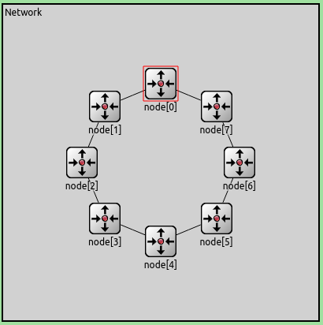

​	Por ejemplo, en el caso uno, donde los paquetes se envían desde los nodos 0 y 2 hacia el nodo 5, si observamos la topología de la red, es fácil notar que si enviamos siempre el paquete por lnk[0] (gráficamente por la derecha), los paquetes del nodo 0 darán siempre 3 saltos, pasando por los nodos 7, 6 y finalmente 5, mientras que los del nodo 2 darán 2 saltos hasta llegar al nodo 0, pasando por los nodos 1 y 0, y luego darán todos los saltos que dan los paquetes del nodo 0, es decir, un total de 5 saltos.
​	
​	Es fácil notar la ineficiencia del algoritmo en este caso, porque si los nodos 2, 3 y 4 enviaran sus paquetes por el link 1, es decir, gráficamente por la izquierda, los paquetes del nodo 2 llegarían a su destino haciendo solo 2 saltos, y con el beneficio extra de que ningún enlace se estaría utilizando para enviar paquetes de más de un emisor. Es decir, la carga de la red estaría más distribuida. 
​	
​	Tomamos algunas métricas en ambos casos 1 y 2 para mejorar nuestro entendimiento del funcionamiento de la red con el algoritmo inicial, así como para poder comparar el comportamiento de la red de manera sencilla luego de  intentar mejorar el algoritmo de enrutamiento utilizado para el envío de paquetes.

### Caso 1 

​	Los nodos 0 y 2 envían paquetes al nodo 5.

#### Ocupación de los buffers

​	El gráfico a continuación muestra la evolución de la ocupación de los buffers del enlace 0 de cada uno de los nodos durante toda la simulación.

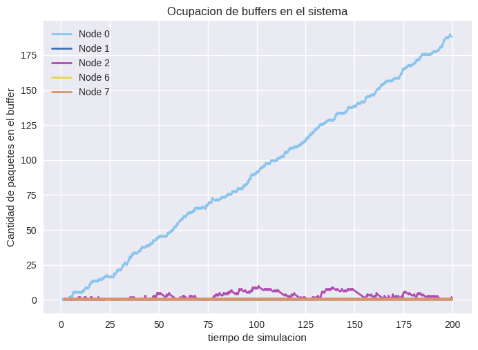
	Podemos observar que los buffers de los nodos generadores se van llenando, ya que la velocidad de generación es mayor que la velocidad de envío que tienen ambos. Sin embargo, el nodo 0 tiene una carga en el buffer mucho más alta, ya que no solo se están generando paquetes para ser enviados por la red hasta el receptor, sino que también transitan todos los paquetes que vienen desde el nodo 2.


#### Selección de los enlaces

​	El gráfico a continuación muestra un conjunto de barras horizontales donde cada una de las barras corresponde a un nodo y representa el porcentaje de veces que se eligió el enlace 1 o 0 para enviar un paquete. Estos porcentajes se calculan de la siguiente manera:

- 	Porcentaje de veces que se eligió 0: es la relación entre la cantidad de paquetes enviados por el enlace 0 y la cantidad total de paquetes enviados, expresada en términos de porcentaje (multiplicada por 100).
-     Porcentaje de veces que se eligió 1: es la relación entre la cantidad de paquetes enviados por el enlace 1 y la cantidad total de paquetes enviados, expresada en términos de porcentaje (multiplicada por 100).

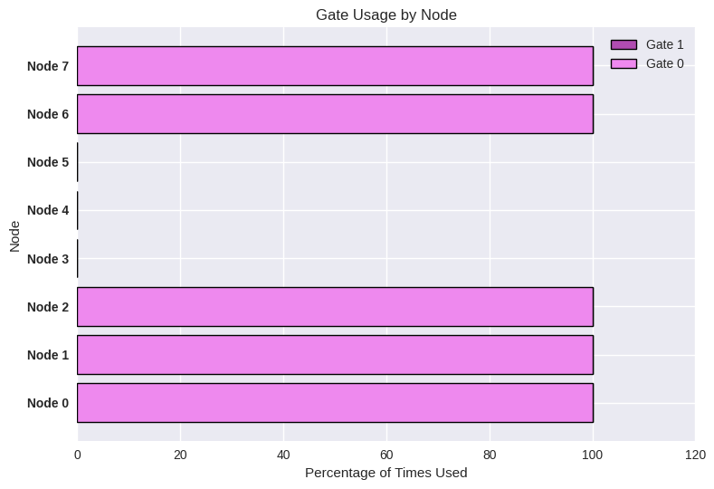

​	Como era de esperar debido a la descripción del algoritmo inicial realizada previamente, todos los nodos eligen enviar por la compuerta o enlace número 0. Sin embargo, se puede observar que los nodos 3 y 4 no están enviando ningún paquete, es decir, toda la carga de la red se distribuye entre los demás nodos. Es importante destacar que el nodo número 5 no envía paquetes porque es el nodo destinatario de todos los paquetes de la red. Cualquier paquete que llegue al nodo 5 estará destinado a él mismo, por lo cual lo enviara a su capa de aplicación.

### Caso 2

​	Los nodos 0, 1, 2, 3, 4, 6 y 7 envían paquetes al nodo 5.

#### Ocupación de los bufferes

​	El gráfico a continuación muestra la evolución de la ocupación de los buffers del enlace 0 de cada uno de los nodos durante los primeros 20 segundos de la simulación. Este comportamiento se repite durante toda la simulación de manera similar, por lo cual decidimos graficar solo los primeros 20 segundos.

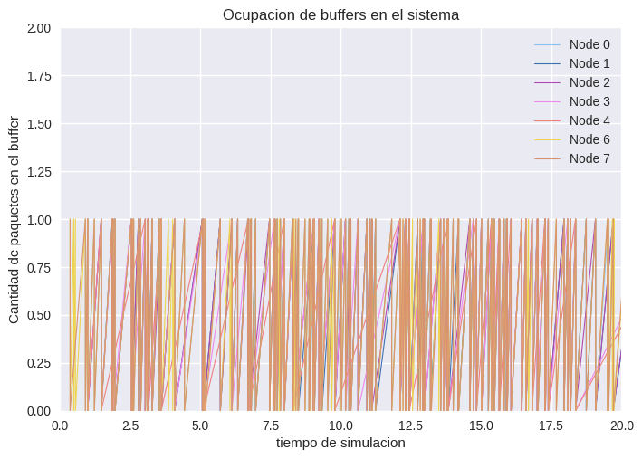		

​	Podemos observar que la ocupación de los buffers de los nodos solo varía entre 0 y 1 paquetes, es decir, cada paquete que llega a un nodo es reenviado por alguno de los enlaces o a la capa de aplicación antes de que llegue otro paquete.


#### Selección de los enlaces

​	El gráfico a continuación muestra un conjunto de barras horizontales donde cada una de las barras corresponde a un nodo y representa el porcentaje de veces que se eligió el enlace 1 o 0 para enviar un paquete. Estos porcentajes se calculan de la siguiente manera:

- 	​	Porcentaje de veces que se eligió 0: es la relación entre la cantidad de paquetes enviados por el enlace 0 y la cantidad total de paquetes enviados, expresada en términos de porcentaje (multiplicada por 100).	
-     ​    Porcentaje de veces que se eligió 1: es la relación entre la cantidad de paquetes enviados por el enlace 1 y la cantidad total de paquetes enviados, expresada en términos de porcentaje (multiplicada por 100).

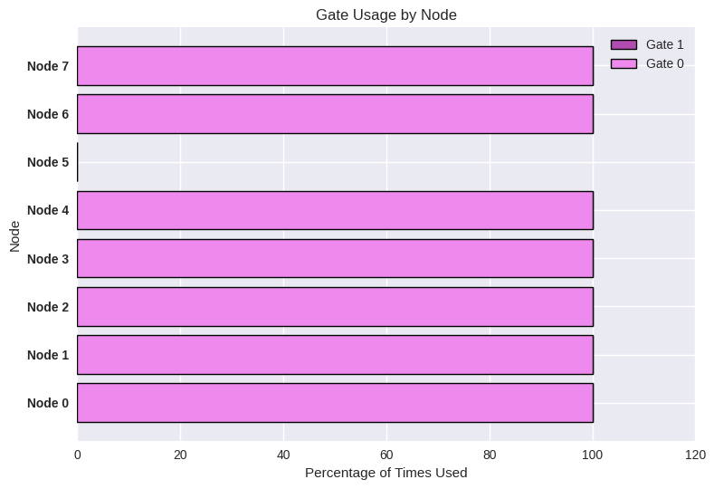

​	Como era de esperar debido a la descripción del algoritmo inicial realizada previamente, todos los nodos eligen enviar por la compuerta o enlace número 0 y el nodo número 5 no envía paquetes porque es el nodo destinatario de todos los paquetes de la red. Cualquier paquete que llegue al nodo 5 estará destinado a él mismo, por lo cual lo enviara a su capa de aplicación.


### Análisis general de ambos casos

​	Dos variables importantes a tener en cuenta son el delay y la cantidad de saltos que da un paquete antes de llegar a destino. ¿Por qué? Porque podríamos definir una mejora en el enrutamiento utilizando estos parámetros. Sería deseable que el delay de entrega del paquete, es decir, la diferencia de tiempo que transcurre desde que es enviado por el emisor hasta que llega a destino, sea lo más reducida posible. También podriamos entender como mejora que el paquete tome caminos más cortos hacia el destino, es decir, que utilice la menor cantidad posible de nodos intermedios.
​	
​	En nuestro caso, este comportamiento debería disminuir el tiempo de delay del paquete, ya que todos los enlaces tienen la misma capacidad de transferencia, es decir, los paquetes se envían a la misma velocidad entre cualquier par de nodos de la red. Además, si consideramos un escenario general, podríamos desear que nuestro paquete pase por la menor cantidad de nodos intermedios para evitar la posibilidad de que alguno de ellos interfiera en la comunicación, ya sea para ofuscarla o espiarla.
​	
​	En este trabajo, nuestro algoritmo de mejora se va a centrar en intentar reducir la cantidad de saltos que dan los paquetes, intentando no empeorar el tiempo de delay. Por lo tanto, recolectamos métricas del promedio de saltos y de delay de los paquetes para poder comparar luego de implementar la mejora.

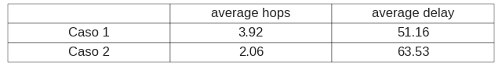


---


## Métodos: 

### Definición de la clase TransportPacket: 
Esta clase hereda de cPacket, que es una clase base para paquetes en OMNeT++. Tiene dos variables miembro: destination para almacenar el identificador del destino del paquete y length para almacenar la longitud del paquete. Además, tiene una estructura interna idList que se utiliza para almacenar una lista de identificadores y la cantidad de saltos que ha dado cada identificador en el camino del paquete. La lista está implementada como una lista enlazada simple.
La clase TransportPacket proporciona métodos para establecer y obtener el destino del paquete, agregar elementos a la lista de identificadores y obtener la longitud del paquete.

### Definición de la clase Net:
Esta clase hereda de cSimpleModule, que es una clase base para los módulos en OMNeT++.
La clase Net representa un nodo en la red de comunicación y yiene variables miembro para almacenar vectores de estadísticas y un puntero a un arreglo de enteros. 

La clase Net implementa los métodos initialize(), finish() y handleMessage(cMessage *msg).

#### initialize():
Se inicializa el vector de estadísticas y se crea un nuevo paquete TransportPacket. El destino del paquete se establece en el índice del módulo padre (el nodo actual) y se agrega el índice del módulo padre a la lista de identificadores del paquete. A continuación, se envía el paquete al módulo "toLnk" con una puerta de salida de índice 0 y destino a nosotros mismos. Esto lo hacemos para poder "reconocer" a todos los nodos dentro de la red.


#### finish():
Se llama al finalizar la simulación. Aquí se libera la memoria asignada para el arreglo de índices de nodos.

#### handleMessage(cMessage *msg): 
Se encarga de manejar los mensajes recibidos por el módulo. Si el tipo de mensaje es -1, se interpreta como un paquete de transporte. Si el destino del paquete es el índice del módulo actual, se guarda la longitud del paquete y se copia la lista de identificadores en el arreglo nodeIndexArray.

Si el destino no es el módulo actual, se agrega el índice del módulo actual a la lista de identificadores del paquete y se reenvía al módulo "toLnk" con una puerta de salida de índice 0. (reconocimiento de red).

Si el tipo de mensaje no es -1, se interpreta como un paquete genérico. Si el destino del paquete es el índice del módulo actual, se registra la cantidad de saltos que ha dado el paquete en el vector de estadísticas y se reenvía al módulo "toApp" para su procesamiento final. Si el destino no es el módulo actual, se incrementa el contador de saltos del paquete y se decide a qué puerta de salida enviar el paquete en función de la posición del destino en el arreglo nodeIndexArray. La elección de la puerta de salida depende de si el destino está más cerca en sentido horario o antihorario en el anillo de nodos. Se registra la elección de la puerta de salida en el vector de estadísticas y se envía el paquete al módulo "toLnk" con la puerta de salida correspondiente.

### Logica de envío de paquetes genericos
La lógica de los envíos en esta simulación se basa en la idea de un anillo de nodos, donde cada nodo tiene una posición específica en el anillo. Los paquetes se envían de un nodo a otro en función de la posición de los nodos en el anillo. Cuando un paquete llega a un nodo, se verifica si el destino final del paquete es el nodo actual. Si es así, el paquete se envía al módulo "toApp" para su procesamiento final. Si el destino no es el nodo actual, se decide a qué nodo vecino enviar el paquete en función de la posición del destino en el anillo. La elección del nodo vecino se hace considerando si el destino está más cerca en sentido horario o antihorario en el anillo de nodos. El paquete se envía al nodo vecino correspondiente a través del módulo "toLnk".


---

## Resultados:

​	Comparemos ahora los resultados analizados anteriormente en la seccion  [Análisis de la implementación inicial](#Análisis-de-la-implementación-inicial:) con los obtenidos luego de implementar el algoritmo detallado en **ACA LINK A LA PARTE DE JUAN DEL INFORMEEEEE** en cada uno de los casos.

### Caso 1

​	Los nodos 0 y 2 envían paquetes al nodo 5.

#### Ocupación de los buffers

​	Los gráficos a continuación muestran la evolución de la ocupación de los buffers del enlace 0 y 1, respectivamente, de cada uno de los nodos durante toda la simulación. A diferencia del algoritmo inicial, luego de nuestra mejora se utilizan ambos enlaces, por lo cual hay más información para analizar, ya que cada enlace tiene su propio buffer.

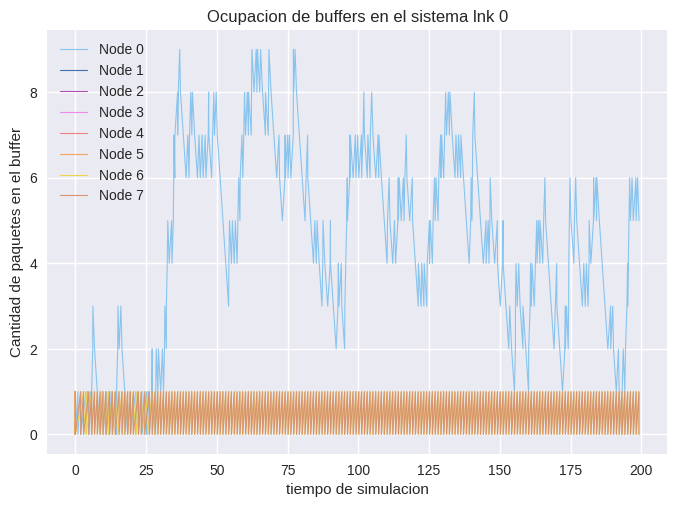

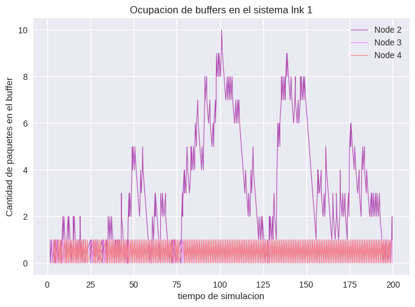

​	Podemos observar una vez más que los únicos nodos cuyos buffers se sobrecargan por encima de 0 o 1 paquetes son los nodos 0 en el primer gráfico y el nodo 2 en el segundo. Esto se debe nuevamente a que la velocidad de generación es mayor que la velocidad de envío que tienen ambos nodos. Sin embargo, podemos notar cierta mejora en la ocupación de los buffers, ya que el buffer del lnk 0 del nodo 0 alcanza un máximo de alrededor de 9 o 10 paquetes, mientras que en el caso inicial su máxima ocupación era mucho más alta. Esto se debe a que la carga de paquetes que transita por el nodo cero ahora es menor, ya que los paquetes del nodo dos no lo usan como intermediario para llegar a su destino.

#### Selección de los enlaces

​	El gráfico a continuación muestra un conjunto de barras horizontales donde cada una de las barras corresponde a un nodo y representa el porcentaje de veces que se eligió el enlace 1 o 0 para enviar un paquete. Estos porcentajes se calculan de la siguiente manera:

- 	​	Porcentaje de veces que se eligió 0: es la relación entre la cantidad de paquetes enviados por el enlace 0 y la cantidad total de paquetes enviados, expresada en términos de porcentaje (multiplicada por 100).	
-     ​    Porcentaje de veces que se eligió 1: es la relación entre la cantidad de paquetes enviados por el enlace 1 y la cantidad total de paquetes enviados, expresada en términos de porcentaje (multiplicada por 100).

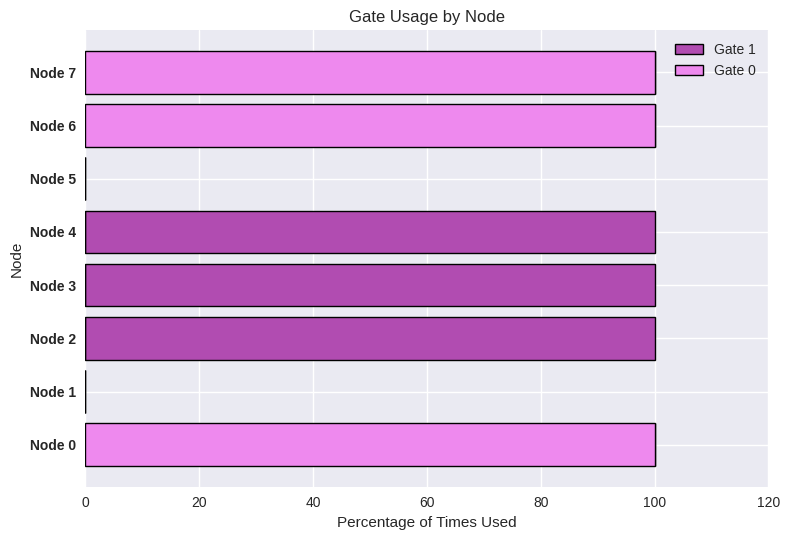

​	En este gráfico podemos observar el principal cambio que ha realizado nuestro algoritmo sobre la red, ya que podemos ver cómo los nodos eligen tanto el enlace número 0 (derecho) como el enlace número 1 (izquierdo). Los nodos que sirven como intermediarios para el reenvío de paquetes generados por el nodo cero eligen siempre la compuerta derecha o 0. Si observamos la distancia en saltos entre el nodo 0 (emisor) y el nodo 5 (destinatario) por la derecha, es de 3 saltos, mientras que por la izquierda es de 5 saltos. De manera análoga, los nodos que sirven como intermediarios para el reenvío de paquetes generados por el nodo dos eligen siempre la compuerta izquierda o 1. Si observamos la distancia en saltos entre el nodo 2 (emisor) y el nodo 5 (destinatario) por la izquierda, es de 3 saltos, mientras que por la derecha es de 5 saltos.
​		
​	Nuestro algoritmo está consiguiendo un enrutamiento más óptimo en cuanto a minimizar la cantidad de saltos que le lleva a los paquetes llegar desde el emisor al receptor.

### Caso 2

​	Los nodos 0, 1, 2, 3, 4, 6 y 7 envían paquetes al nodo 5.

#### Ocupación de los buffers

​	Al igual que en el caso 1, los gráficos a continuación muestran la evolución de la ocupación de los buffers del enlace 0 y 1, respectivamente, de cada uno de los nodos durante toda la simulación, ya que nuestra mejora genera enrutamientos que utilizan ambos enlaces. 

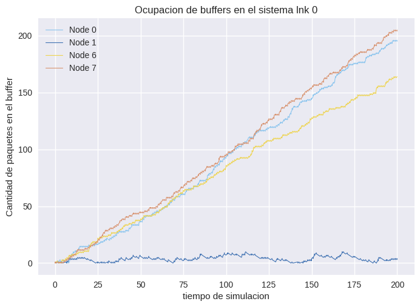
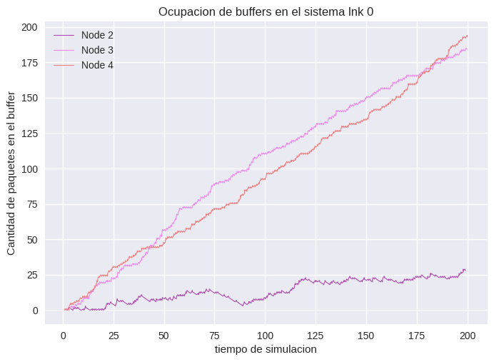

​	En estos gráficos podemos observar el aumento de la carga de paquetes que hay en la red, ya que todos los buffers están más congestionados. Nuestro algoritmo agrega un tiempo extra antes del reenvío de los paquetes, ya que hay que decidir por qué enlace nos conviene enviarlo, por lo cual algunos paquetes se acumulan en los buffers de los nodos. Además, al estar todos los nodos, excepto el 5, generando paquetes hacia el mismo destinatario, hay muchos nodos que no solo son emisores, sino que también sirven como nodos intermediarios del envío de paquetes de otros nodos. Los nodos que tienen este comportamiento son los que más se congestionan en los gráficos de ambos enlaces, ya que son los que manejan más carga de paquetes.

#### Selección de los enlaces

​	El gráfico a continuación muestra un conjunto de barras horizontales donde cada una de las barras corresponde a un nodo y representa el porcentaje de veces que se eligió el enlace 1 o 0 para enviar un paquete. Estos porcentajes se calculan de la siguiente manera:

- 	​	Porcentaje de veces que se eligió 0: es la relación entre la cantidad de paquetes enviados por el enlace 0 y la cantidad total de paquetes enviados, expresada en términos de porcentaje (multiplicada por 100).	
-     ​    Porcentaje de veces que se eligió 1: es la relación entre la cantidad de paquetes enviados por el enlace 1 y la cantidad total de paquetes enviados, expresada en términos de porcentaje (multiplicada por 100).

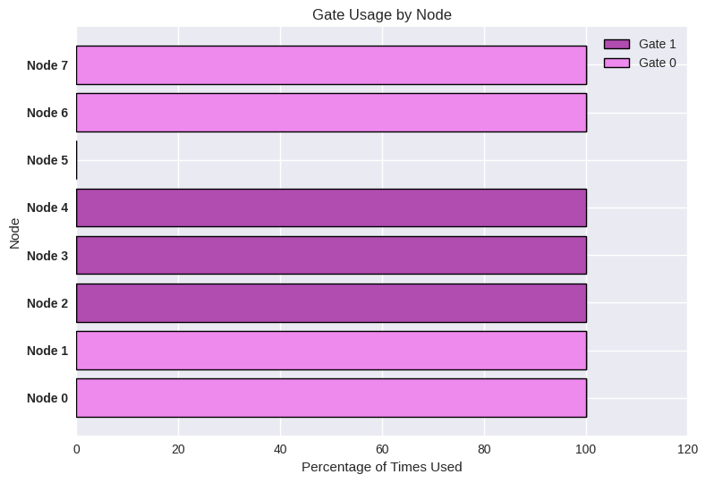

​	En este gráfico podemos ver cómo se usan ambos enlaces, 0 (derecho) y 1 (izquierdo). Cada nodo se encarga de calcular por qué lado le conviene enviar el paquete para que la distancia en saltos hasta el receptor (nodo 5) sea mínima. En cada nodo, la distancia es la siguiente:

```
+------+------------------------+--------------------------+
| Node | Enlace 0 o por derecha | Enlace 1 o por izquierda |
+------+------------------------+--------------------------+
|   7  |            2           |             6            |
+------+------------------------+--------------------------+
|   6  |            1           |             7            |
+------+------------------------+--------------------------+
|   4  |            7           |             1            |
+------+------------------------+--------------------------+
|   3  |            6           |             2            |
+------+------------------------+--------------------------+
|   2  |            5           |             3            |
+------+------------------------+--------------------------+
|   1  |            4           |             4            |
+------+------------------------+--------------------------+
|   0  |            3           |             5            |
+------+------------------------+--------------------------+

```
​	Cada uno de los nodos cuenta con esta información de antemano antes de enviar paquetes de datos, debido al transport package que se envía al iniciar la simulación, y por ello se toman las decisiones de la forma que se muestra en el gráfico. Nuevamente, nuestro algoritmo está consiguiendo un enrutamiento más óptimo en cuanto a minimizar la cantidad de saltos que le lleva a los paquetes llegar desde el emisor al receptor.

### Análisis general de ambos casos

​	Recolectamos las estadísticas mencionadas en el modelo inicial para su comparación con las recolectadas en el modelo actual.

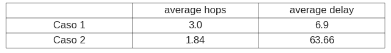

​	Analicemos cada caso por separado porque son bastante distintos:
​	
**Caso 1:** 

​	Vemos una gran mejora, ya que redujimos la cantidad de saltos promedio de 3.92 en el modelo inicial a 3, y el retraso de 51.16 a 6.9. Esto se debe a que el principal limitante de este caso es el nodo 2, que genera que los nodos 0, 7 y 6 estén continuamente enviando paquetes generados por él y por 0, congestionando la red. En lugar de eso, debería elegir enviar sus paquetes en el sentido contrario, lo que no solo reduce la congestión de los enlaces, sino que también disminuye la cantidad de saltos que deben realizar sus paquetes. Por esta razón, nuestro algoritmo mejorado, que toma la decisión correcta en cuanto al envío de los paquetes generados por el nodo 2, mejora significativamente el desempeño de nuestra red.
​	
**Caso 2:** 

​	Vemos una mejora, ya que reducimos la cantidad de saltos promedio de 2.06 en el modelo inicial a 1.84, y el retraso aumenta ligeramente de 63.53 a 63.66. Esto se debe a que, al enviar los paquetes por los caminos más cortos, logramos disminuir la cantidad de saltos. Sin embargo, podría decirse que nuestro algoritmo empeora un poco el funcionamiento de la red, ya que aumenta ligeramente el retardo de los paquetes. En este caso, dependerá del uso que le queramos dar a la red. Si consideramos la velocidad de llegada del paquete como prioridad sobre la cantidad de saltos que realiza cada paquete, nos convendría el algoritmo inicial. Mientras que si priorizamos la cantidad de saltos por sobre el tiempo de entrega, la mejora del algoritmo es más eficiente. Una vez más, esto depende del contexto en el cual se utiliza la red.


# FALTA UNA PEQUEÑA CONCLUSION ACAAAAA

---
## Discusión:
### Limitaciones
Nuestro algoritmo no funcionaría bien para networks con una topologia que no sea ciclica. 
Debido a que el renocimiento de la red se basa en esta caracteristica de la red.
Modificando, principalmente el reconocimiento de la red posiblemente pueda funcionar en grafos con diferente topologia.

### Posibles mejoras en la implementación
Se podría agregar un paquete nuevo que informe de congestion en alguna de las compuertas de un nodo. 
Es decir si la "gate" 1 está saturada, enviar un paquete con destino a mi mismo en sentido horario o antihorario el cual informe a toda la red que la "gate" 1 está congestionada y que solo se puede acceder por la "gate" 0 (podriamos agregar una nueva "gate" en cada nodo para manejar solo estos paquetes) 

---


## Bibliografía o Referencias

- Andrew S. Tanenbaum 5ta Edición. *Computer Networks* . Ed. Pearson              <------ ESTO ES UN EJEMPLO

- [www.javatpoint.com What is a ring topology?](https://www.javatpoint.com/what-is-a-ring-topology) 06/06/2023 

-  [www.computerhope.com Ring topology]( https://www.computerhope.com/jargon/r/ringtopo.htm#advantages) 06/06/2023
